# Design Document

## Overview

The Image Manager is a Flask-based web application that provides secure image hosting and management through a browser interface. The system follows a traditional MVC architecture with server-side rendering using Jinja2 templates, file-based user authentication, and local filesystem storage for uploaded content.

## Architecture

### System Architecture Diagram

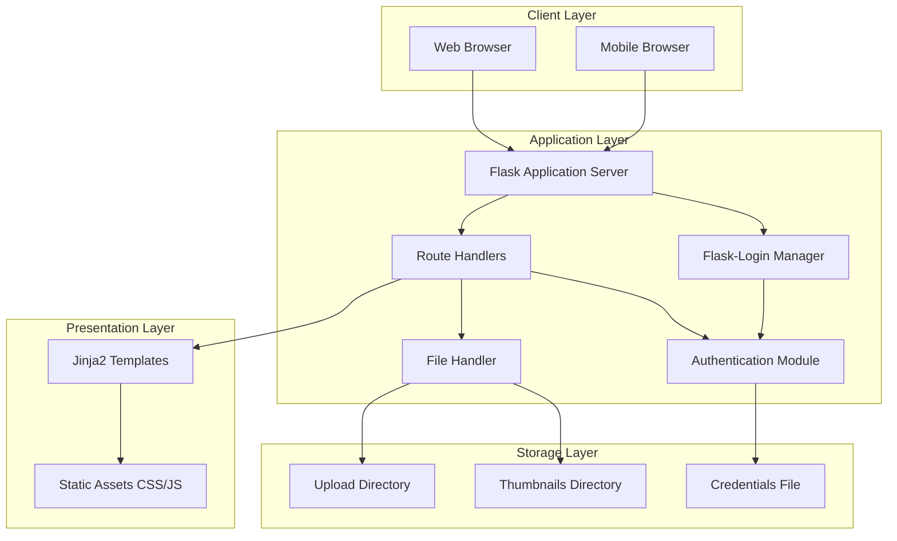

### Request Flow Diagram

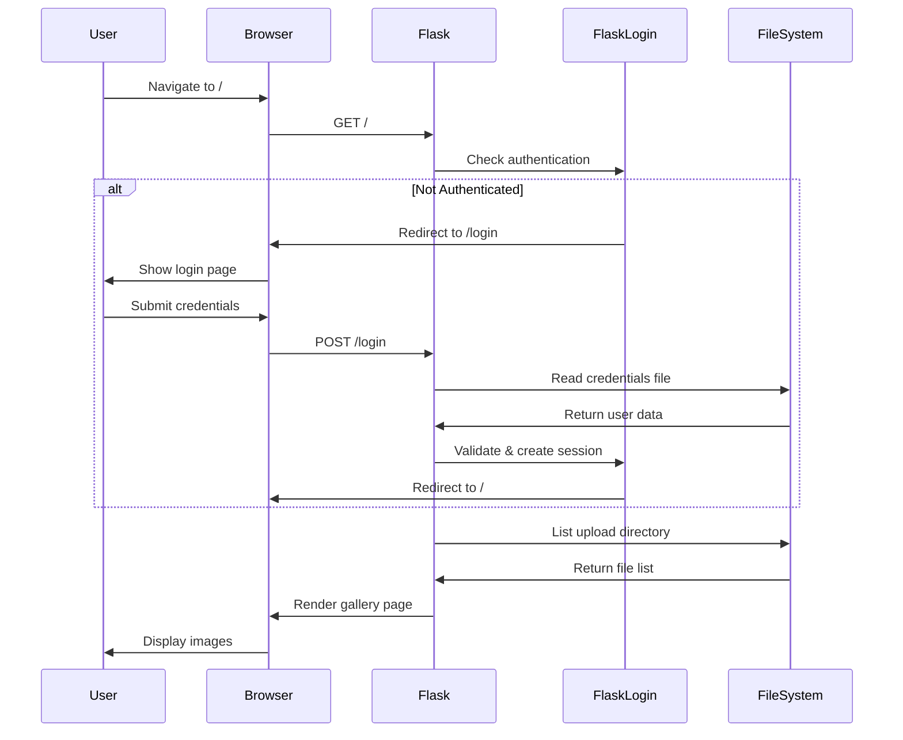

## Components and Interfaces

### 1. Flask Application Core

**Purpose:** Main application initialization and configuration

**Key Responsibilities:**
- Application configuration management
- Route registration
- Extension initialization (Flask-Login)
- Directory structure setup

**Configuration:**
```python
UPLOAD_FOLDER = 'uploads'
ALLOWED_EXTENSIONS = {'jpg', 'jpeg', 'png', 'gif', 'ico', 'b64'}
USER_CREDENTIALS_FILE = 'user_credentials.txt'
REMEMBER_COOKIE_DURATION = 30 * 24 * 3600  # 30 days
THUMBNAIL_SIZE = (800, 800)
```

### 2. Authentication Module

**Purpose:** User authentication and session management

**Component Diagram:**

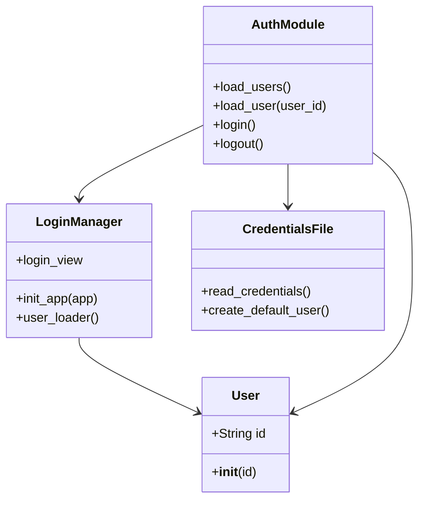

**Key Functions:**

- `load_users()`: Reads and parses the credentials file
  - Returns: Dictionary mapping usernames to password hashes
  - Handles missing file by creating default admin user
  - Skips malformed lines and comments

- `load_user(user_id)`: Flask-Login callback for session management
  - Returns: User object if valid, None otherwise

**Credentials File Format:**
```
username:password_hash
# Comments start with #
admin:scrypt:32768:8:1$salt$hash
```

### 3. File Management Module

**Purpose:** Handle file uploads, storage, and retrieval

**File Upload Flow:**

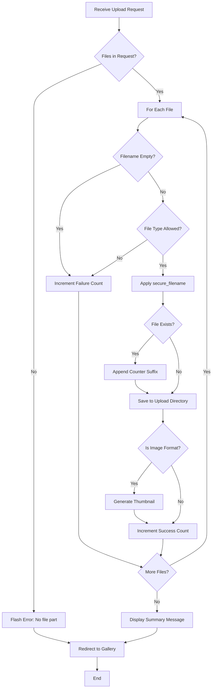

**Key Functions:**

- `allowed_file(filename)`: Validates file extension
- `secure_filename(filename)`: Sanitizes filename (from werkzeug)
- `create_thumbnail(path)`: Generates 800x800px thumbnail using PIL
- `get_image_mime_type(filename)`: Returns appropriate MIME type

**Filename Conflict Resolution:**
```python
# Example: image.jpg exists
# Result: image_1.jpg, image_2.jpg, etc.
base, ext = os.path.splitext(filename)
counter = 1
while os.path.exists(new_target):
    new_filename = f"{base}_{counter}{ext}"
    counter += 1
```

### 4. Gallery Display Module

**Purpose:** Render paginated file gallery with thumbnails

**Pagination Logic:**


**Pagination Parameters:**
- Items per page: 50
- Page calculation: `total_pages = (total_files + per_page - 1) // per_page`
- Slice calculation: `start = (page - 1) * per_page`

### 5. Frontend Components

**Template Structure:**

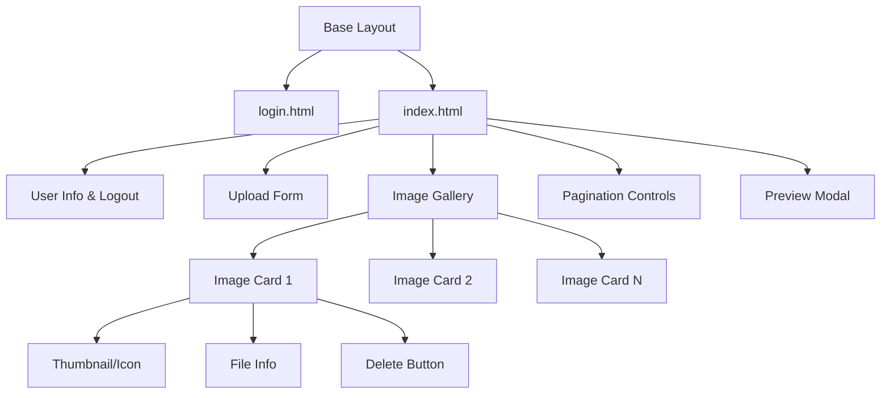

**JavaScript Modules:**

1. **Modal Preview System**
   - Click thumbnail → Open modal with full image
   - ESC key / Click outside → Close modal
   - Double-click → Toggle 1.5x zoom
   - Touch gestures → Pinch-to-zoom

2. **Delete Confirmation**
   - Intercept delete clicks
   - Show native confirm dialog
   - Proceed only on confirmation

3. **Password Toggle**
   - Toggle password visibility
   - Switch eye icon (fa-eye ↔ fa-eye-slash)

## Data Models

### User Model

```python
class User(UserMixin):
    """
    Represents an authenticated user session
    Implements Flask-Login's UserMixin interface
    """
    def __init__(self, id: str):
        self.id = id  # Username
    
    # Inherited from UserMixin:
    # - is_authenticated: Always True for valid users
    # - is_active: Always True
    # - is_anonymous: Always False
    # - get_id(): Returns self.id
```

### File Metadata

Files are not stored in a database but managed through filesystem operations:

```python
{
    'name': str,        # Filename with extension
    'mtime': float,     # Modification timestamp
    'path': str,        # Full filesystem path
    'thumb_path': str   # Thumbnail path (if image)
}
```

### Credentials Storage

Plain text file with format:
```
username:password_hash
```

**Password Hash Format (Werkzeug scrypt):**
```
scrypt:32768:8:1$salt$hash_value
```

## Security Architecture

### Security Layers Diagram

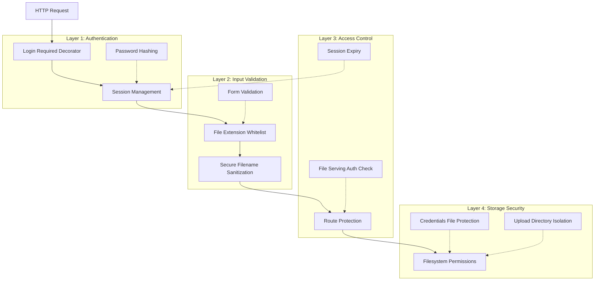

### Security Features

#### 1. Password Security

**Hashing Algorithm:** Scrypt (via Werkzeug)
- Memory-hard algorithm resistant to hardware attacks
- Automatic salt generation
- Parameters: N=32768, r=8, p=1

**Implementation:**
```python
# Password hashing
password_hash = generate_password_hash(password)

# Password verification
is_valid = check_password_hash(password_hash, password)
```

#### 2. Session Security

**Features:**
- Secure session cookies
- Configurable expiry (30 days with "remember me")
- Server-side session validation
- Automatic redirect on expiry

**Session Flow:**

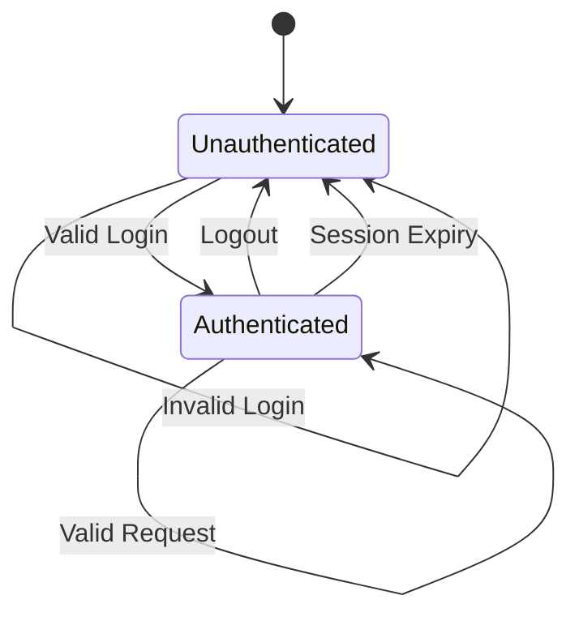

#### 3. File Upload Security

**Protection Mechanisms:**

1. **Extension Whitelist**
   ```python
   ALLOWED_EXTENSIONS = {'jpg', 'jpeg', 'png', 'gif', 'ico', 'b64'}
   ```

2. **Filename Sanitization**
   - Uses `werkzeug.utils.secure_filename()`
   - Removes path traversal attempts (../, ..\)
   - Strips special characters
   - Converts to ASCII

3. **File Type Validation**
   - Extension-based checking
   - MIME type assignment on serving

#### 4. Route Protection

All file operations require authentication:

```python
@app.route('/')
@login_required
def index():
    # Protected route

@app.route('/uploads/<filename>')
@login_required
def serve_image(filename):
    # Protected file serving
```

### Security Recommendations

**Current Gaps:**

1. **Secret Key:** Hardcoded `'your_secret_key_here'` should be environment variable
2. **HTTPS:** No SSL/TLS enforcement (should use reverse proxy)
3. **File Size Limits:** No maximum upload size configured
4. **Rate Limiting:** No protection against brute force login attempts
5. **CSRF Protection:** No CSRF tokens on forms
6. **Credentials Storage:** Plain text file instead of database

**Recommended Improvements:**

```python
# Environment-based configuration
app.secret_key = os.environ.get('SECRET_KEY')
app.config['MAX_CONTENT_LENGTH'] = 16 * 1024 * 1024  # 16MB limit

# Add Flask-WTF for CSRF protection
from flask_wtf.csrf import CSRFProtect
csrf = CSRFProtect(app)

# Add rate limiting
from flask_limiter import Limiter
limiter = Limiter(app, key_func=get_remote_address)

@app.route('/login', methods=['POST'])
@limiter.limit("5 per minute")
def login():
    # Rate-limited login
```

## Error Handling

### Error Handling Strategy

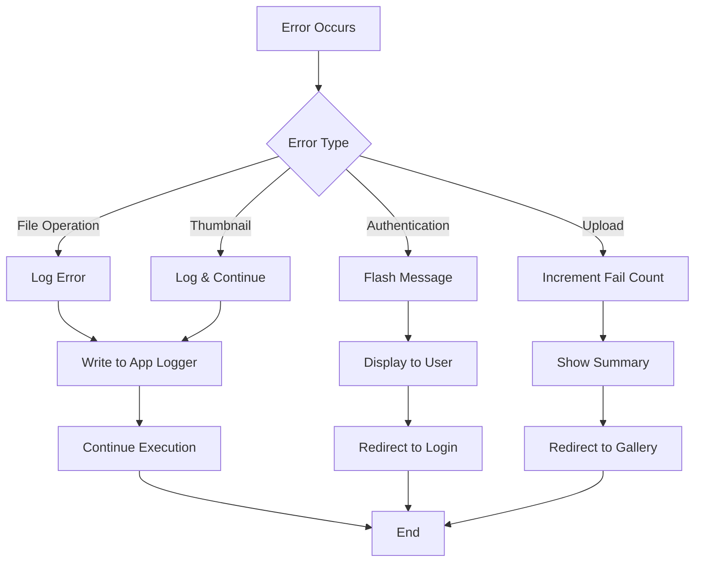

### Error Categories

#### 1. Authentication Errors
- **Invalid credentials:** Flash error message, remain on login page
- **Missing credentials file:** Auto-create with default user, log warning
- **Malformed credential lines:** Skip line, log warning, continue

#### 2. File Operation Errors
- **Upload failure:** Log error, increment failure count, show summary
- **File not found on delete:** Flash error message
- **Thumbnail generation failure:** Log error, continue without thumbnail

#### 3. System Errors
- **Missing upload directory:** Auto-create on startup
- **Permission errors:** Log detailed error message
- **Session errors:** Redirect to login page

### Logging Strategy

```python
# Error logging examples
app.logger.error(f"Error loading users: {str(e)}")
app.logger.error(f"Error saving file {filename}: {str(e)}")
app.logger.error(f"Thumbnail creation failed: {str(e)}")
app.logger.warning(f"Created default user: {username} with password: {password}")
```

## Testing Strategy

### Test Pyramid

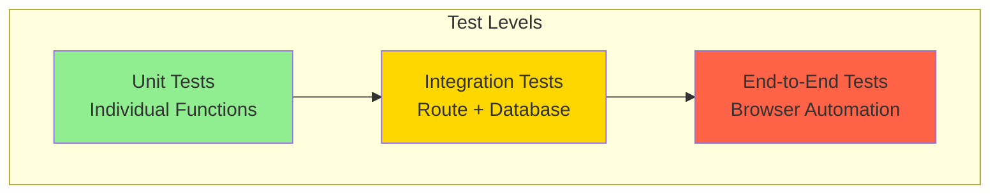

### Unit Tests

**Authentication Module:**
- `test_load_users_with_valid_file()`
- `test_load_users_creates_default_user()`
- `test_load_users_skips_malformed_lines()`
- `test_password_hashing_and_verification()`

**File Handler Module:**
- `test_allowed_file_with_valid_extensions()`
- `test_allowed_file_with_invalid_extensions()`
- `test_secure_filename_sanitization()`
- `test_filename_conflict_resolution()`
- `test_thumbnail_generation()`
- `test_get_image_mime_type()`

### Integration Tests

**Authentication Flow:**
- `test_login_with_valid_credentials()`
- `test_login_with_invalid_credentials()`
- `test_logout_clears_session()`
- `test_remember_me_functionality()`
- `test_protected_routes_redirect_unauthenticated()`

**File Upload Flow:**
- `test_upload_single_file()`
- `test_upload_multiple_files()`
- `test_upload_with_duplicate_filename()`
- `test_upload_invalid_file_type()`
- `test_thumbnail_created_for_images()`

**Gallery Display:**
- `test_gallery_shows_uploaded_files()`
- `test_gallery_pagination()`
- `test_gallery_sorting_by_date()`

**File Deletion:**
- `test_delete_existing_file()`
- `test_delete_nonexistent_file()`

### End-to-End Tests

**User Workflows:**
- Complete login → upload → view → delete workflow
- Multi-file upload with mixed valid/invalid types
- Image preview modal interaction
- Mobile responsive behavior
- Session persistence across page refreshes

### Test Data Setup

```python
@pytest.fixture
def test_credentials_file(tmp_path):
    """Create temporary credentials file"""
    cred_file = tmp_path / "test_credentials.txt"
    password_hash = generate_password_hash("testpass123")
    cred_file.write_text(f"testuser:{password_hash}\n")
    return str(cred_file)

@pytest.fixture
def test_upload_dir(tmp_path):
    """Create temporary upload directory"""
    upload_dir = tmp_path / "uploads"
    upload_dir.mkdir()
    return str(upload_dir)

@pytest.fixture
def test_image():
    """Create test image file"""
    img = Image.new('RGB', (100, 100), color='red')
    return img
```

## Performance Considerations

### Current Performance Characteristics

**Strengths:**
- Thumbnail generation reduces gallery load time
- Pagination limits DOM size for large collections
- Static file serving is efficient

**Bottlenecks:**
- Synchronous file I/O blocks request handling
- No caching for thumbnails or file lists
- Credentials file read on every login
- No database indexing (filesystem-based)

### Optimization Opportunities

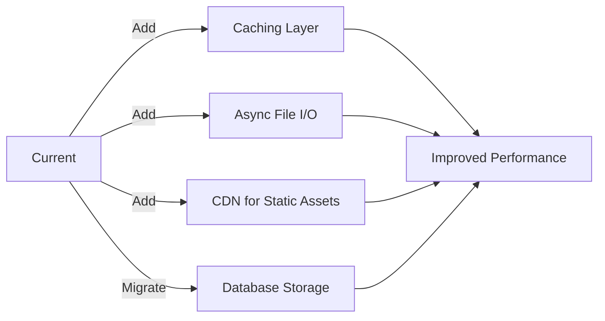

**Recommended Optimizations:**

1. **Caching:**
   ```python
   from flask_caching import Cache
   cache = Cache(app, config={'CACHE_TYPE': 'simple'})
   
   @cache.cached(timeout=300)
   def get_file_list():
       # Cache file list for 5 minutes
   ```

2. **Async Thumbnail Generation:**
   ```python
   from celery import Celery
   
   @celery.task
   def generate_thumbnail_async(file_path):
       # Background thumbnail generation
   ```

3. **Database Migration:**
   - Move from file-based to SQLite/PostgreSQL
   - Add indexes on filename, upload_date
   - Store file metadata for faster queries

## Deployment Architecture

### Production Deployment Diagram

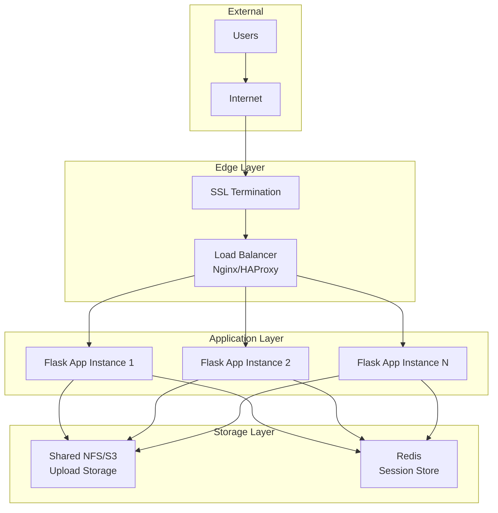

### Deployment Recommendations

**WSGI Server:**
```bash
# Use Gunicorn instead of Flask dev server
gunicorn -w 4 -b 0.0.0.0:8000 app:app
```

**Reverse Proxy (Nginx):**
```nginx
server {
    listen 80;
    server_name example.com;
    
    location / {
        proxy_pass http://127.0.0.1:8000;
        proxy_set_header Host $host;
        proxy_set_header X-Real-IP $remote_addr;
    }
    
    location /static {
        alias /path/to/static;
        expires 30d;
    }
}
```

**Environment Configuration:**
```bash
export SECRET_KEY="$(python -c 'import secrets; print(secrets.token_hex(32))')"
export FLASK_ENV=production
export USER_CREDENTIALS_FILE=/secure/path/credentials.txt
```

## Technology Stack Summary

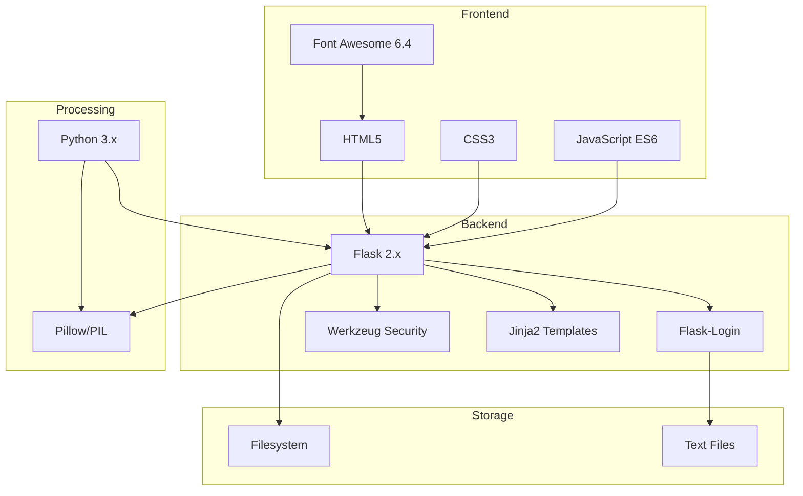

### Dependencies

**Core:**
- Flask: Web framework
- Flask-Login: Session management
- Werkzeug: Security utilities, file handling
- Jinja2: Template engine (included with Flask)

**Image Processing:**
- Pillow (PIL): Thumbnail generation, image manipulation

**Frontend:**
- Font Awesome 6.4.0: Icons (CDN)
- Vanilla JavaScript: No framework dependencies

**Python Standard Library:**
- os: File operations
- secrets: Secure random generation
- string: String utilities

### Browser Compatibility

**Supported:**
- Chrome/Edge 90+
- Firefox 88+
- Safari 14+
- Mobile browsers (iOS Safari, Chrome Mobile)

**Required Features:**
- CSS Grid
- Flexbox
- ES6 JavaScript
- Touch events
- File API
